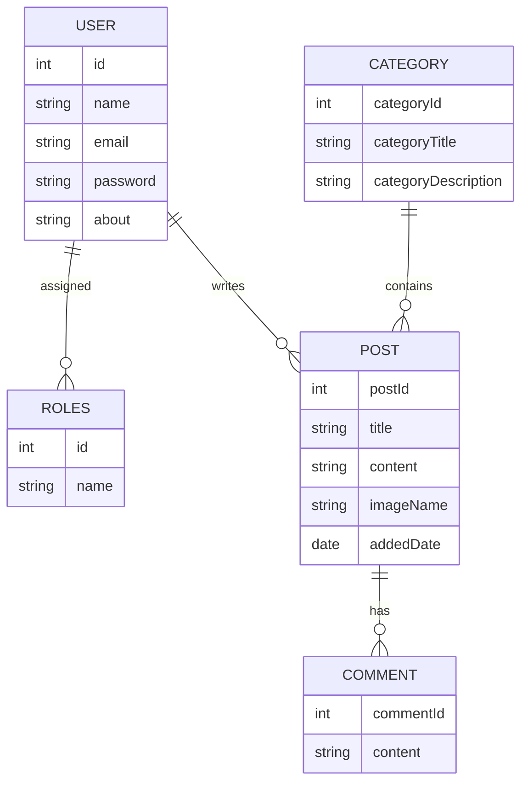

# 📝 Blog App APIs (Spring Boot)

A fully-featured **RESTful Blog Application** built with **Spring Boot**, **Spring Security (JWT)**, **JPA/Hibernate**, and **MySQL**.  
It supports **user authentication, role-based access control, CRUD APIs for posts, comments, categories, file uploads, and search functionality**.  
Includes **Swagger API documentation** for easy testing. 🚀

---

## 🔥 Features
✅ Developed a RESTful blogging application with user registration, login, and role-based access (Admin/User) 
✅ Implemented JWT-based authentication and authorization to secure APIs and restrict access based on user roles.
✅ Designed and built endpoints for posts, comments, categories, and user management using Spring Data JPA  
✅ Enabled users to add, update, and delete comments, and categorize posts. 
✅ Implemented pagination and sorting for blog posts using Spring Data JPA to enhance performance and user 
experience.Integrated 
✅ Image upload functionality for posts and handled file storage.
✅ Used DTOs for clean data transfer and implemented global exception handling for better error management. 
✅ Documented all APIs using Swagger for easy consumption by frontend/client teams. 
✅ Configured different application profiles (dev, test, prod) and deployed the application on AWS. 

---

## 🛠️ Tech Stack
| Technology      | Purpose                          |
|-----------------|----------------------------------|
| Spring Boot     | Application framework           |
| Spring Security | Authentication & Authorization  |
| JWT             | Token-based authentication     |
| Spring Data JPA | ORM for DB operations          |
| Hibernate       | JPA Implementation             |
| MySQL           | Database                       |
| Maven           | Build Tool                     |
| Swagger (OpenAPI)| API Documentation             |
| Lombok          | Boilerplate code reduction     |

---

# 🔑 API Endpoints

| Method | Endpoint                    | Description                |
|--------|----------------------------|----------------------------|
| POST   | `/api/user/`               | Register a new user       |
| POST   | `/api/user/login`          | Login & get JWT token     |
| GET    | `/api/post/`               | Get all posts (Paginated) |
| GET    | `/api/post/{id}`           | Get a single post         |
| POST   | `/api/user/{id}/post`      | Create a post             |
| GET    | `/api/post/search/{query}` | Search posts by title     |
| POST   | `/api/category/`           | Create category           |
| DELETE | `/api/post/{id}`           | Delete post               |

---

# 🗂️ Entity Relationship Diagram (ERD)

